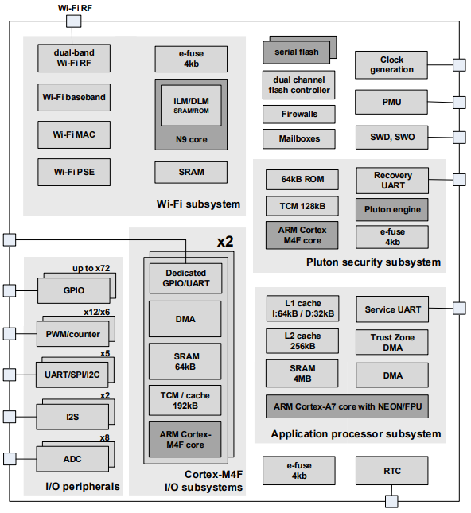

# [MT3620](https://github.com/SoCXin/MT3620)

* [MediaTek](https://www.mediatek.com/): [Cortex-A7+2xM4+N9](https://github.com/SoCXin/Cortex)
* [L7R7](https://github.com/SoCXin/Level): 500MHz + 2x200MHz + Andes N9

## [简介](https://github.com/SoCXin/MT3620/wiki)

[MT3620](https://github.com/SoCXin/MT3620) tri-core MCU

### 关键特性

* MediaTek NeuroPilot-Micro为一款在MT3620 Cortex-M4上支持部署和高效运行ML模型的tinyML架构。

#### 封装规格

* LQFP100 (14×14mm)
* LQFP144 (20×20mm)

### [资源收录](https://github.com/SoCXin)

* [参考资源](src/)
* [参考文档](docs/)
* [参考工程](project/)

### [选型建议](https://github.com/SoCXin)

[MT3620](https://github.com/SoCXin/MT3620)

### [探索芯世界 www.SoC.xin](http://www.SoC.Xin)
